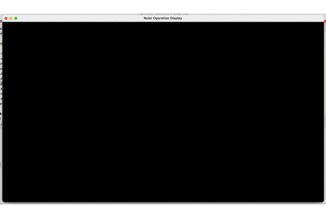
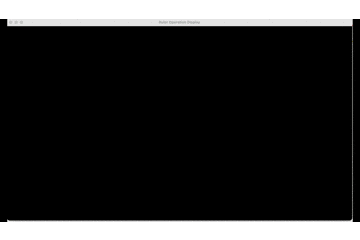
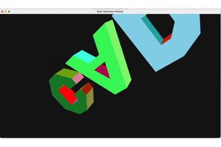

# CAD Euler Operation

## 项目说明
本项目基于半边数据结构(B-rep)实现了以下几种欧拉操作

- mvfs
- mev
- mef
- kemr
- kfmrh

以及一个sweep操作

### 项目结构
```
.
├── B-rep.cpp            // **半边数据结构**实现
├── B-rep.h              // **半边数据结构**定义
├── EulerOperation.cpp   // **欧拉操作和扫掠操作**实现
├── EulerOperation.h     // **欧拉操作和扫掠操作**定义
├── EulerTest.h          // 几个使用欧拉操作制作的**测试模型**
├── ModelPainter.cpp     // **模型绘制**实现
├── ModelPainter.h       // **模型绘制**定义
├── common.cpp           // 公共方法和定义
├── common.h             // 公共方法和定义
└── main.cpp             // 主函数s
```

## 编译方法
本项目在macOS 11.0下使用Apple clang 12.0.0成功编译，只需创建build目录，然后使用cmake和make编译即可

```shell
mkdir build && cd build
cmake ..
make
```
build目录下就会生成一个`CADEulerOperation`可执行文件，运行即可。

## 运行效果图




